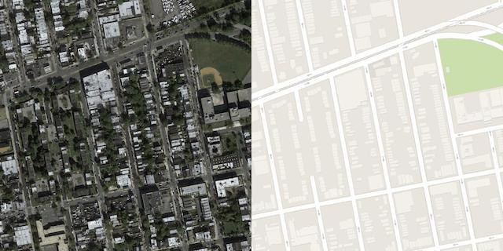
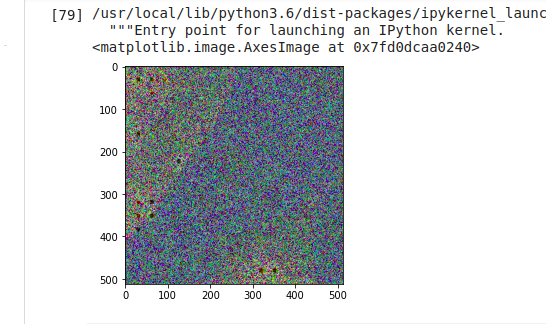

# Pix2Pix GAN Aerial to Map Generation

<ul>
	<li>Implemented Pix2Pix using Pytorch</li>
	<li>Load Dataset using DataLoader API in Pytorch</li>
	<li>Use Transfor API for transformation</li>
	<li>Pytorch version 1.6 + CUDA enabled</li>
</ul>
<b>Paper:</b> https://arxiv.org/pdf/1611.07004.pdf

Dataset Link : https://www.kaggle.com/vikramtiwari/pix2pix-dataset

<b>Reference Links:</b> 
<ul>
	<li>https://www.groundai.com/project/geogan-a-conditional-gan-with-reconstruction-and-style-loss-to-generate-standard-layer-of-maps-from-satellite-images/1 </li>
	<li>https://machinelearningmastery.com/how-to-develop-a-pix2pix-gan-for-image-to-image-translation/</li>
</ul>

<h3>Results</h3>

